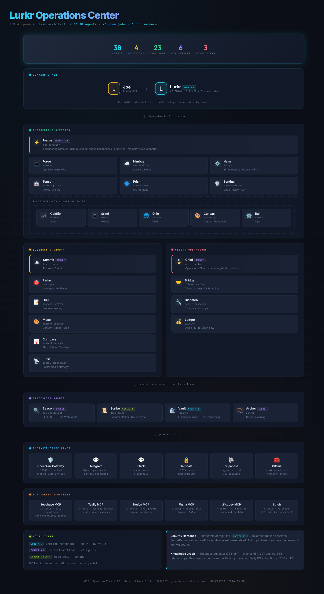

<h1 align="center">
    
</h1>

<h3 align="center">🚀 Generative AI Full-Stack Developer • React Native • Supabase • Stripe | San Diego, CA | Open to 150k+ roles 🚀</h3>

 

🔭 **Currently building**: [The Skate Workshop](https://theskateworkshop.app) - Live coaching app in React Native Beta

🏰 **Latest launch**: [RenFaire Guide](https://renfaireguide.com) - The largest Renaissance Faire directory (218+ listings across all 50 states)

💼 **Running**: [Joe's Tech Solutions LLC](https://joestechsolutions.com) - Full-stack web/mobile for small businesses

🤖 **AI Projects**: [DALL-E Clone](https://jblas-dall-e.com) • [ZenFu AI Law Firm](https://github.com/joblas/zenfu_ai_lawfirm) • [LLM Apps Collection](https://github.com/joblas/awesome-llm-apps)

🌱 **Currently exploring**: Multi-Agent Orchestration, Private AI Infrastructure, SEO Automation

💬 Ask me about **React Native, Supabase, Stripe, AI Agents, or spec-driven workflows [here](https://github.com/joblas/joblas/issues)**

⚡ Fun fact: **I build production apps using AI-augmented development with Claude Code**

  
  
  
  
  

<h2 align="center">🚀 Featured Project: The Skate Workshop 🚀</h2>
 

  

 

| Tech | Details |
|------|---------|
| **Frontend** | React Native (Expo) + TypeScript |
| **Backend** | Supabase Edge Functions (18+), PostgreSQL RLS |
| **Database** | 40+ tables with Row Level Security |
| **Payments** | Stripe Connect + Webhooks (revenue splits) |
| **Built With** | Claude Code, AI Agents, Docker, AWS/GCP |

<h2 align="center">🏰 Featured Project: RenFaire Guide 🏰</h2>
 

  

 

**The most comprehensive Renaissance Faire directory in the US — 218+ festivals across all 50 states**

| Tech | Details |
|------|---------|
| **Frontend** | Next.js 15 + TypeScript + Tailwind CSS |
| **Database** | Supabase PostgreSQL (pg_trgm fuzzy search, RLS) |
| **Hosting** | Vercel (SSG + ISR for 200+ pages) |
| **SEO** | Schema.org Event structured data, dynamic sitemaps, 90+ indexed pages |
| **Monetization** | Booking.com + ThredUp affiliate integrations (Awin) |
| **Design** | Custom warm burgundy/gold design system, Framer Motion animations |
| **Built With** | AI-augmented development (Claude Code + 24-agent orchestration) |

<h2 align="center">⚒️ Languages-Frameworks-Tools ⚒️</h2>
 

    
     
    
     
    

 

  
  
  
  
  
  

<h2 align="center">💼 Joe's Tech Solutions LLC 💼</h2>
 

  

 

**Boutique software studio creating mobile apps, web platforms, and private AI infrastructure**

✅ Supabase/Postgres production DBs (40+ tables)

✅ Stripe subscription platforms with revenue splits

✅ AWS/GCP/Azure infrastructure + Docker deployments

✅ End-to-end delivery: specs → code → deploy → ops

 

🤖 <strong>Under the Hood: Lurkr AI Operations Center</strong> — 30-agent AI team powering my development workflow

 

I built a 30-agent AI team on OpenClaw that autonomously handles engineering, business development, and client operations. **Lurkr** (Claude Opus 4.6) acts as my AI Chief of Staff — I talk to one agent, and it silently delegates across 4 specialized divisions.

| | |
|---|---|
| **30 Agents** | Engineering, Business & Growth, Client Ops, Skate Workshop |
| **6 MCP Servers** | Supabase, Tavily, Notion, Figma, 21st.dev, Stitch |
| **Knowledge Graph** | Supabase pgvector + 327 entities, 635 relationships |
| **Channels** | Telegram, Slack, Tailscale HTTPS |
| **Models** | Claude Opus 4.6, Sonnet 4.5, Gemini 3 Flash |

 

| Recent Projects | Description |
|-----------------|-------------|
| [RenFaire Guide](https://renfaireguide.com) | Renaissance Faire directory — 218+ listings, Next.js + Supabase |
| [The Skate Workshop](https://theskateworkshop.app) | Live coaching app - React Native Beta |
| [HBrothers Website](https://github.com/joblas/hbrothers-website) | Website redesign using Google AI Studio |
| [Cbarrgs Vibe Haven](https://github.com/joblas/cbarrgs-vibe-haven) | Artist portfolio (Cbarrgs.com) |
| [ZenFu AI Law Firm](https://github.com/joblas/zenfu_ai_lawfirm) | CrewAI virtual law firm with specialized agents |
| [DALL-E Clone](https://jblas-dall-e.com) | AI image generation web application |

  <h2>🐍 My Contributions 🐍</h2>
   
  

    

<h2 align="center">⚡ Stats ⚡</h2>
 

  
  
   
  

  

<h2 align="center">🏆 GitHub Achievements 🏆</h2>
 

  
  
  

<h2 align="center">📫 Let's Connect 📫</h2>
 

**Actively seeking full-time (150k+) or contract work. Available immediately.** 🚀

 

| Platform | Link |
|----------|------|
| 📧 Email | [joe@joestechsolutions.com](mailto:joe@joestechsolutions.com) |
| 💼 LinkedIn | [linkedin.com/in/joseph-blas](https://linkedin.com/in/joseph-blas) |
| 🌐 Portfolio | [joestechsolutions.com](https://joestechsolutions.com) |
| 🤗 HuggingFace | [huggingface.co/jblas](https://huggingface.co/jblas) |
| 📝 Medium | [joeblas.medium.com](https://joeblas.medium.com) |
| 🎨 DALL-E | [jblas-dall-e.com](https://jblas-dall-e.com) |

 

  

 
